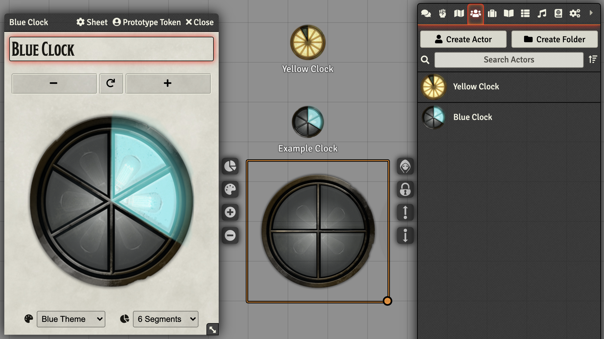
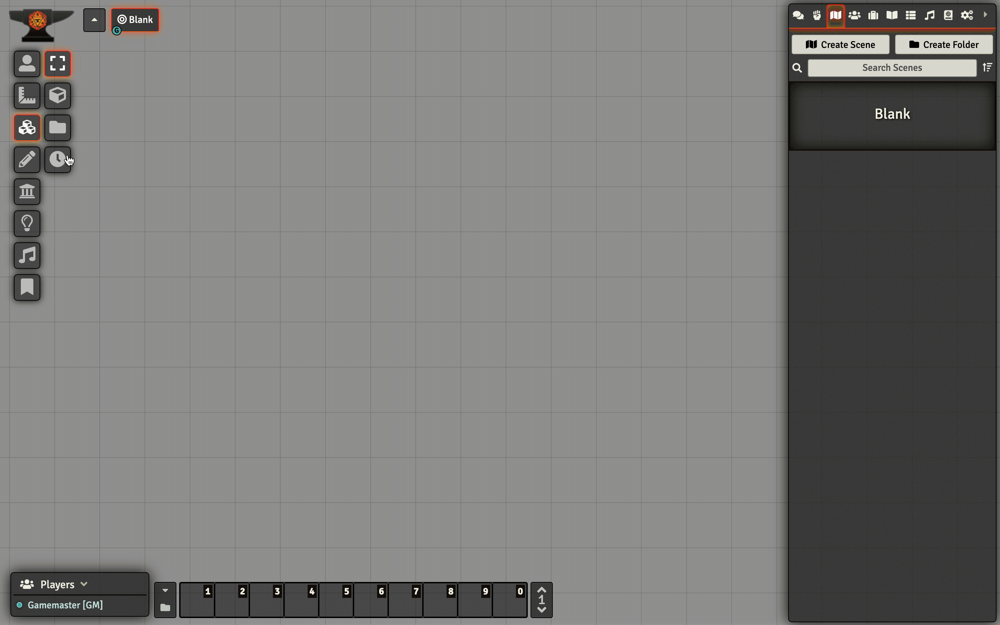

# Foundry VTT: Clocks

A module that lets you create [Blades in the Dark](https://bladesinthedark.com/)-esque [progress clocks](https://bladesinthedark.com/progress-clocks) within [Foundry VTT](https://foundryvtt.com/). Supports both ad hoc Tiles for use in a single scene and long-lasting Actor variants.

## Installation

1. Copy this link and use it in Foundry's Module Manager to install the module.

```
https://raw.githubusercontent.com/troygoode/fvtt-clocks/main/module.json
```
    
2. Enable the Module in your World's module settings.

## Demos



### Clock Actors


### Clock Tiles



## License

Clock artwork by [Tim Denee (@dog_blink)](https://twitter.com/dog_blink/status/987137570512420869).

This module is available as open source under the terms of the MIT License.

[MIT License](http://www.opensource.org/licenses/mit-license.php)
